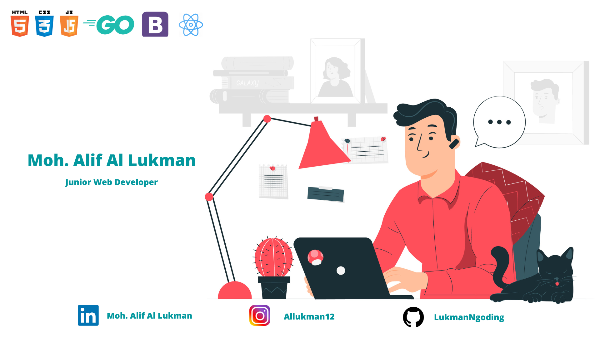

### Hi there 
This is the place where I opensource stuff and break things :rofl:

- 🔭 &nbsp;I’m currently working on something cool :wink:
- 🌱 &nbsp;I’m currently learning Flutter, Go, React js, Typescript, Next js, 

🔗 &nbsp;**Connect with me**

